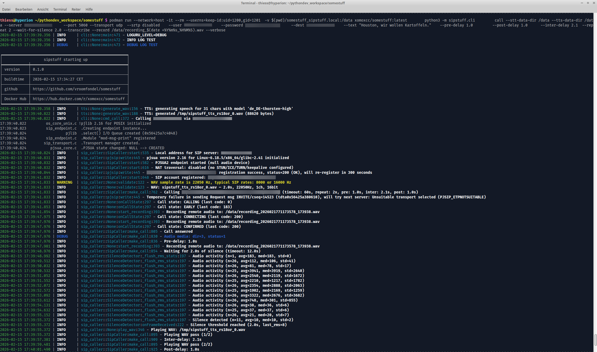
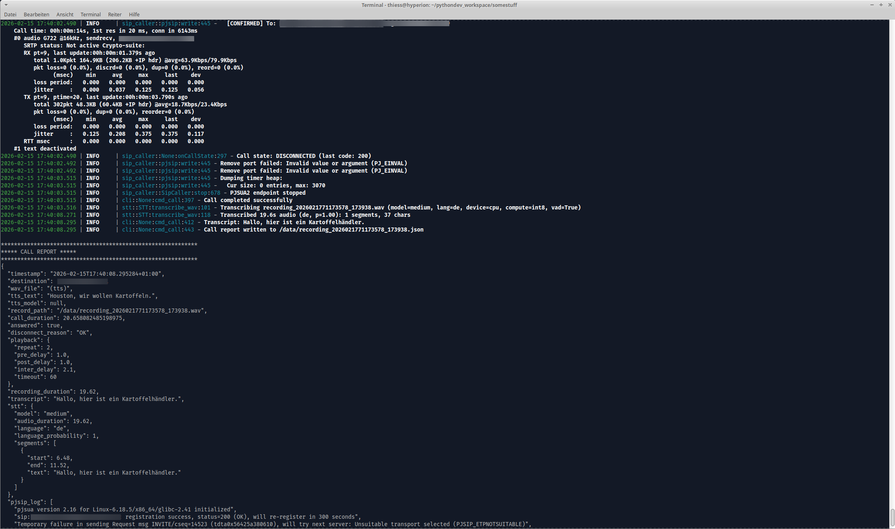
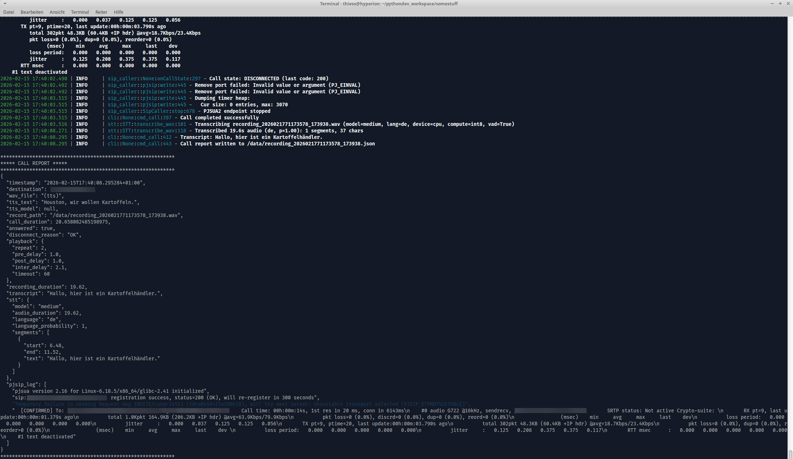

# sipstuff
---
### ⚠️ ⚠️ ⚠️  WIP

REWRITE ongoing from https://github.com/vroomfondel/somestuff/tree/main/sipstuff

---

SIP telephony automation toolkit — place phone calls and play WAV files or TTS-generated speech via [PJSUA2](https://www.pjsip.org/). Includes speech-to-text transcription of recorded calls via [faster-whisper](https://github.com/SYSTRAN/faster-whisper). Supports incoming call handling with auto-answer, live TTS, and real-time transcription.

## Overview

Registers with a SIP/PBX server, dials a destination, plays a WAV file (or synthesizes text via [piper TTS](https://github.com/rhasspy/piper)) on answer, and hangs up. Designed for headless/container operation (uses a null audio device, no sound card required). Supports UDP, TCP, and TLS transports with optional SRTP media encryption. Can also act as a callee — auto-answering incoming calls with WAV playback, real-time TTS, or live transcription.

## Prerequisites

PJSIP with Python bindings (`pjsua2`) must be installed. The main project Dockerfile builds PJSIP from source in a multi-stage build. For local development:

```bash
# Debian/Ubuntu prerequisites
sudo apt install build-essential python3-dev swig \
    libasound2-dev libssl-dev libopus-dev wget

# Build and install PJSIP (default: 2.16)
./dist_scripts/install_pjsip.sh

# Or specify a version
PJSIP_VERSION=2.14.1 ./dist_scripts/install_pjsip.sh
```

Other Python dependencies: `pydantic`, `ruamel.yaml`, `loguru`, `tabulate`, `soundfile`, `numpy`.

Optional extras (installable via `pip install sipstuff[extra]`):
- **`cuda`** — NVIDIA CUDA libraries for GPU-accelerated STT (`nvidia-cublas-cu12`, `nvidia-cudnn-cu12`)
- **`openvino`** — Intel OpenVINO backend for STT (`optimum-intel[openvino]`)
- **`training`** — Voice training utilities (`pynput`, `PySide6`)

For TTS support: install `piper-tts` (optional, only needed for `--text`). Because `piper-phonemize-fix` has no Python 3.14 wheels, the Docker image uses a separate Python 3.13 virtualenv at `/opt/piper-venv`. Resampling TTS output requires `ffmpeg`.

For STT support: `pip install faster-whisper` (optional, only needed for transcription). Whisper models are auto-downloaded on first use (~1.5 GB for the `medium` model).

For local audio playback: `pip install sounddevice` (optional, only needed for `--play-audio`).

## CLI Usage

The CLI provides six subcommands: `call`, `tts`, `stt`, `callee_autoanswer`, `callee_realtime-tts`, and `callee_live-transcribe`.

```bash
# Via entry point (after pip install)
sipstuff-cli <subcommand> [args...]

# Via module
python -m sipstuff.cli <subcommand> [args...]
```

### `tts` — Text-to-Speech

Generate a WAV file from text using piper TTS (no SIP server needed):

```bash
# Basic German TTS
python -m sipstuff.cli tts "Hallo Welt" -o hello.wav

# English voice, resampled to 8 kHz for narrowband SIP
python -m sipstuff.cli tts "Hello World" -o hello.wav \
    --model en_US-lessac-high --sample-rate 8000

# Custom model directory
python -m sipstuff.cli tts "Achtung!" -o alert.wav --tts-data-dir /opt/piper-voices

# Generate and play back on speakers
python -m sipstuff.cli tts "Test" -o test.wav --play-audio
```

| Flag | Description |
|------|-------------|
| `text` (positional) | Text to synthesize |
| `--output`, `-o` | Output WAV file path (required) |
| `--model`, `-m` | Piper voice model (default: `de_DE-thorsten-high`) |
| `--sample-rate` | Resample to this rate in Hz (0 = native) |
| `--tts-data-dir` | Directory for piper voice models (default: `~/.local/share/piper-voices`) |
| `--play-audio` | Play generated audio on speakers via sounddevice |
| `--audio-device` | Sounddevice output device index or name substring |
| `--verbose`, `-v` | Debug logging |

### `stt` — Speech-to-Text

Transcribe a WAV file using faster-whisper (no SIP server needed):

```bash
# Basic transcription (German, medium model)
python -m sipstuff.cli stt recording.wav

# English, smaller model, JSON output with metadata
python -m sipstuff.cli stt recording.wav --language en --model small --json

# Disable Silero VAD pre-filtering (VAD is on by default)
python -m sipstuff.cli stt recording.wav --no-vad

# CUDA acceleration with large model
python -m sipstuff.cli stt recording.wav --device cuda --model large-v3

# OpenVINO backend
python -m sipstuff.cli stt recording.wav --backend openvino --model base
```

The `--json` flag outputs structured JSON including segment timestamps, audio duration, and language probability:

```json
{
  "text": "Ja, mach schon, jetzt ist es auch wurscht.",
  "audio_duration": 17.4,
  "language": "de",
  "language_probability": 1.0,
  "segments": [
    {"start": 0.0, "end": 1.52, "text": "Ja, mach schon,"},
    {"start": 1.52, "end": 3.84, "text": "jetzt ist es auch wurscht."}
  ]
}
```

| Flag | Description |
|------|-------------|
| `wav` (positional) | Path to WAV file to transcribe |
| `--backend` | STT backend: `faster-whisper` (default) or `openvino` |
| `--model`, `-m` | Whisper model size or HuggingFace model ID (default: `medium`) |
| `--language`, `-l` | Language code (default: `de`) |
| `--device` | Compute device: `cpu` or `cuda` (default: `cpu`) |
| `--compute-type` | Quantization: `int8`, `float16`, `float32` (auto-selected by default) |
| `--data-dir` | Directory for Whisper models (default: `~/.local/share/faster-whisper-models`) |
| `--json` | Output result as JSON with metadata and segment timestamps |
| `--no-vad` | Disable Silero VAD pre-filtering (VAD is on by default, recommended for phone recordings) |
| `--verbose`, `-v` | Debug logging |

### `call` — Place a SIP Call

```bash
# Minimal — using a config file with a WAV file
python -m sipstuff.cli call --config sip_config.yaml --dest +491234567890 --wav alert.wav

# Using CLI flags directly (no config file)
python -m sipstuff.cli call \
    --server pbx.local --user 1000 --password secret \
    --dest +491234567890 --wav alert.wav

# Connection via environment variables, only destination and audio via CLI
export SIP_SERVER=pbx.local SIP_USER=1000 SIP_PASSWORD=secret
python -m sipstuff.cli call --dest +491234567890 --wav alert.wav

# TTS instead of a WAV file (no audio file needed)
python -m sipstuff.cli call \
    --server pbx.local --user 1000 --password secret \
    --dest +491234567890 \
    --text "Achtung! Wasserstand kritisch!" \
    --tts-model de_DE-thorsten-high --tts-sample-rate 8000

# Wait for callee to finish speaking before playback
python -m sipstuff.cli call \
    --server pbx.local --user 1000 --password secret \
    --dest +491234567890 --wav alert.wav \
    --wait-for-silence 1.0

# Record, transcribe, and write JSON call report
python -m sipstuff.cli call \
    --server pbx.local --user 1000 --password secret \
    --dest +491234567890 --wav alert.wav \
    --record /tmp/recording.wav --transcribe \
    --wait-for-silence 1.0

# Record both RX and TX, then mix to stereo
python -m sipstuff.cli call \
    --server pbx.local --user 1000 --password secret \
    --dest +491234567890 --wav alert.wav \
    --record /tmp/rx.wav --record-tx /tmp/tx.wav \
    --mix-mode stereo --mix-output /tmp/mixed.wav

# TTS with a custom model directory
python -m sipstuff.cli call \
    --config sip_config.yaml --dest +491234567890 \
    --text "Server offline!" \
    --tts-data-dir /opt/piper-voices

# Calling a SIP URI directly (instead of a phone number)
python -m sipstuff.cli call \
    --server pbx.local --user 1000 --password secret \
    --dest sip:conference@pbx.local --wav announcement.wav

# TLS transport with SRTP encryption and playback options
python -m sipstuff.cli call \
    --config sip_config.yaml \
    --transport tls --srtp mandatory \
    --dest +491234567890 --wav alert.wav \
    --pre-delay 1.5 --post-delay 2.0 --inter-delay 1.0 --repeat 3 \
    --timeout 30 -v

# Record with explicit STT options
python -m sipstuff.cli call \
    --config sip_config.yaml --dest +491234567890 --wav alert.wav \
    --record /tmp/recording.wav --transcribe \
    --stt-model small --stt-language en \
    --stt-data-dir /opt/whisper-models

# Live transcription of remote audio during the call
python -m sipstuff.cli call \
    --server pbx.local --user 1000 --password secret \
    --dest +491234567890 --wav alert.wav \
    --live-transcribe -v

# Interactive live TTS — type text during the call that gets spoken in real-time
python -m sipstuff.cli call \
    --server 192.168.1.100 --user 1001 --password secret \
    --dest +491234567890 \
    --interactive \
    --piper-model /path/to/de_DE-thorsten-high.onnx \
    --text "Hallo, hier spricht die Maschine." \
    --play-audio --play-tx --real-capture -v

# Stream remote audio to a Unix socket (for external processing)
python -m sipstuff.cli call \
    --server pbx.local --user 1000 --password secret \
    --dest +491234567890 --wav alert.wav \
    --audio-socket /tmp/sip_audio.sock

# NAT traversal — STUN + ICE behind a NAT gateway
python -m sipstuff.cli call \
    --server pbx.example.com --user 1000 --password secret \
    --stun-servers stun.l.google.com:19302,stun1.l.google.com:19302 \
    --ice \
    --dest +491234567890 --wav alert.wav -v
```

When `--transcribe` is used with `--record`, a JSON call report is written next to the recording (e.g. `/tmp/recording.json`) and also emitted to stdout/loguru for K8s log collection.

#### `call` CLI Flags

**SIP connection:**

| Flag | Description |
|------|-------------|
| `--config`, `-c` | Path to YAML config file |
| `--server`, `-s` | PBX hostname or IP |
| `--port`, `-p` | SIP port (default: 5060) |
| `--user`, `-u` | SIP extension / username |
| `--password` | SIP password |
| `--transport` | `udp`, `tcp`, or `tls` (default: udp) |
| `--srtp` | `disabled`, `optional`, or `mandatory` (default: disabled) |
| `--tls-verify` | Verify TLS server certificate |
| `--dest`, `-d` | Destination phone number or SIP URI (required) |
| `--timeout`, `-t` | Call timeout in seconds (default: 60) |

**Audio source (mutually exclusive):**

| Flag | Description |
|------|-------------|
| `--wav`, `-w` | Path to WAV file to play (mutually exclusive with `--interactive`) |
| `--interactive` | Interactive live TTS mode: type text in the console that gets spoken via Piper TTS during the call (mutually exclusive with `--wav`, requires `--piper-model`) |

**TTS:**

| Flag | Description |
|------|-------------|
| `--text` | Text to synthesize via piper TTS, or initial greeting in interactive mode |
| `--tts-model` | Piper voice model for pre-generated TTS (default: `de_DE-thorsten-high`) |
| `--piper-model` | Path to Piper `.onnx` model for live TTS in interactive mode |
| `--tts-sample-rate` | Resample TTS output to this rate in Hz (default: native/22050) |
| `--tts-data-dir` | Directory for piper voice models (default: `~/.local/share/piper-voices`) |

**Playback timing:**

| Flag | Description |
|------|-------------|
| `--pre-delay` | Seconds to wait after answer before playback (default: 0) |
| `--post-delay` | Seconds to wait after playback before hangup (default: 0) |
| `--inter-delay` | Seconds to wait between WAV repeats (default: 0) |
| `--repeat` | Number of times to play the WAV (default: 1) |
| `--wait-for-silence` | Wait for N seconds of remote silence before playback (e.g. `1.0` to let callee finish "Hello?"). Uses `SilenceDetector` on the incoming audio RMS. Applied after `--pre-delay`. |

**Recording & transcription:**

| Flag | Description |
|------|-------------|
| `--record` | Record remote-party (RX) audio to this WAV file path (parent dirs created automatically) |
| `--record-tx` | Record local (TX) audio to this WAV file path |
| `--mix-mode` | Post-call mix mode: `none`, `mono`, or `stereo` (requires `--record` + `--record-tx`) |
| `--mix-output` | Output path for the RX+TX mix file |
| `--transcribe` | Transcribe recorded audio via STT and write a JSON call report (requires `--record`) |
| `--live-transcribe` | Live STT of remote audio during the call (real-time output to console) |
| `--stt-backend` | STT backend: `faster-whisper` (default) or `openvino` |
| `--stt-model` | Whisper model size for transcription (default: `medium`) |
| `--stt-language` | Language code for STT transcription (default: from config, then `de`) |
| `--stt-data-dir` | Directory for Whisper STT models (default: `~/.local/share/faster-whisper-models`) |

**Live VAD (for `--live-transcribe`):**

| Flag | Description |
|------|-------------|
| `--vad-silence-threshold` | RMS silence threshold (default: 0.01) |
| `--vad-silence-trigger` | Seconds of silence to trigger chunk boundary (default: 0.3) |
| `--vad-max-chunk` | Max seconds per audio chunk (default: 5.0) |
| `--vad-min-chunk` | Min seconds per audio chunk (default: 0.5) |

**Audio device:**

| Flag | Description |
|------|-------------|
| `--no-null-audio` | Use real audio devices instead of null device for both directions |
| `--real-capture` | Use real microphone even when playback stays null |
| `--real-playback` | Use real speaker even when capture stays null |
| `--play-audio` | Play remote-party (RX) audio on local speakers via sounddevice |
| `--play-tx` | Route local (TX) audio to output sinks; stereo with RX when combined with `--play-audio` |
| `--no-play-rx` | Disable routing of RX audio to output sinks |
| `--audio-device` | Sounddevice output device (index or name substring) |
| `--audio-socket` | Unix socket path for live PCM streaming (16 kHz, S16_LE, mono) |

**NAT traversal:**

| Flag | Description |
|------|-------------|
| `--stun-servers` | Comma-separated STUN servers (e.g. `stun.l.google.com:19302`) |
| `--ice` | Enable ICE for media NAT traversal |
| `--turn-server` | TURN relay server (`host:port`) |
| `--turn-username` | TURN username |
| `--turn-password` | TURN password |
| `--turn-transport` | TURN transport: `udp`, `tcp`, or `tls` (default: udp) |
| `--keepalive` | UDP keepalive interval in seconds (0 = disabled) |
| `--public-address` | Public IP to advertise in SDP/Contact (e.g. K3s node IP) |

**Logging:**

| Flag | Description |
|------|-------------|
| `--verbose`, `-v` | Debug logging |
| `--pjsip-log-level` | PJSIP log verbosity (0–6, default: 3) |

### `callee_autoanswer` — Auto-Answer Incoming Calls

Answer incoming calls automatically with optional WAV playback or TTS:

```bash
# Auto-answer with no media (just answer and hold)
python -m sipstuff.cli callee_autoanswer \
    --server pbx.local --user 1001 --password secret

# Auto-answer and play a WAV file
python -m sipstuff.cli callee_autoanswer \
    --server pbx.local --user 1001 --password secret \
    --mode wav --wav-file greeting.wav

# Auto-answer with TTS greeting
python -m sipstuff.cli callee_autoanswer \
    --server pbx.local --user 1001 --password secret \
    --mode tts --tts-text "Hallo, bitte hinterlassen Sie eine Nachricht."

# Full sequence: start WAV → pause → TTS content → pause → end WAV
python -m sipstuff.cli callee_autoanswer \
    --server pbx.local --user 1001 --password secret \
    --mode tts --tts-text "Ihre Nachricht wird aufgezeichnet." \
    --start-wav ding.wav --end-wav bye.wav \
    --pause-before-content 0.5 --pause-before-end 1.0 \
    --answer-delay 2.0
```

| Flag | Description |
|------|-------------|
| `--mode` | Playback mode: `none`, `wav`, or `tts` (default: `none`) |
| `--wav-file` | WAV file to play (requires `--mode wav`) |
| `--tts-text` | Text for TTS (requires `--mode tts`) |
| `--piper-model` | Piper voice model (default: `de_DE-thorsten-high`) |
| `--tts-data-dir` | Piper data directory |
| `--start-wav` | WAV file to play at call start |
| `--end-wav` | WAV file to play before hangup |
| `--pause-before-start` | Pause before start WAV (default: 0.0 s) |
| `--pause-before-content` | Pause before content WAV/TTS (default: 0.0 s) |
| `--pause-before-end` | Pause before end WAV (default: 0.0 s) |
| `--answer-delay` | Seconds before answering (default: 1.0) |
| `--no-auto-answer` | Do not auto-answer calls |

Shared flags: `--config`, `--server`, `--port`, `--user`, `--password`, `--transport`, `--srtp`, `--tls-verify`, `--local-port`, NAT traversal group, `--verbose`, `--pjsip-log-level`

### `callee_realtime-tts` — Incoming Call with Live TTS

Answer incoming calls and speak text in real-time via Piper TTS:

```bash
# Answer and speak a greeting
python -m sipstuff.cli callee_realtime-tts \
    --server pbx.local --user 1001 --password secret \
    --tts-text "Willkommen, wie kann ich Ihnen helfen?" \
    --piper-model /path/to/de_DE-thorsten-high.onnx

# Interactive mode — type text during the call
python -m sipstuff.cli callee_realtime-tts \
    --server pbx.local --user 1001 --password secret \
    --interactive \
    --piper-model /path/to/de_DE-thorsten-high.onnx
```

| Flag | Description |
|------|-------------|
| `--tts-text` | Initial TTS text spoken on answer |
| `--interactive` | Interactive mode: type text in the console that gets spoken live |
| `--piper-model` | Path to Piper `.onnx` model (default: `./de_DE-thorsten-high.onnx`) |
| `--wav-file` | WAV file to play at call start |
| `--play-delay` | Seconds to wait before playback (default: 0.0) |
| `--answer-delay` | Seconds before answering (default: 1.0) |
| `--no-auto-answer` | Do not auto-answer calls |

Shared flags: `--config`, `--server`, `--port`, `--user`, `--password`, `--transport`, `--srtp`, `--tls-verify`, `--local-port`, NAT traversal group, `--verbose`, `--pjsip-log-level`

### `callee_live-transcribe` — Incoming Call with Live Transcription

Answer incoming calls and transcribe remote audio in real-time:

```bash
# Live transcription of incoming calls
python -m sipstuff.cli callee_live-transcribe \
    --server pbx.local --user 1001 --password secret \
    --stt-model base --stt-language de

# With recording and post-call full transcription
python -m sipstuff.cli callee_live-transcribe \
    --server pbx.local --user 1001 --password secret \
    --wav-output /tmp/rx.wav --transcribe \
    --stt-model medium

# With greeting WAV and audio streaming
python -m sipstuff.cli callee_live-transcribe \
    --server pbx.local --user 1001 --password secret \
    --wav-file greeting.wav --play-delay 0.5 \
    --audio-socket /tmp/audio.sock --play-audio
```

| Flag | Description |
|------|-------------|
| `--stt-backend` | STT backend: `faster-whisper` (default) or `openvino` |
| `--stt-model` | Whisper model (default: `base`) |
| `--stt-live-model` | Separate smaller model for live transcription |
| `--stt-device` | Compute device: `cpu` or `cuda` |
| `--stt-language` | Language code for STT |
| `--stt-data-dir` | Whisper model cache directory |
| `--vad-silence-threshold` | RMS silence threshold (default: 0.01) |
| `--vad-silence-trigger` | Seconds of silence to trigger chunk boundary (default: 0.3) |
| `--vad-max-chunk` | Max seconds per audio chunk (default: 5.0) |
| `--vad-min-chunk` | Min seconds per audio chunk (default: 0.5) |
| `--wav-output` | Save RX recording to this path |
| `--wav-output-tx` | Save TX recording to this path |
| `--wav-dir` | Directory for WAV files (default: `..`) |
| `--no-wav` | Do not save WAV recordings |
| `--transcribe` | Full transcription of RX recording after call ends (writes JSON report) |
| `--wav-file` | WAV file to play at call start |
| `--tts-text` | Text for Piper TTS playback at call start |
| `--piper-model` | Piper voice model (default: `de_DE-thorsten-high`) |
| `--tts-data-dir` | Piper data directory |
| `--play-delay` | Seconds to wait before playback (default: 0.0) |
| `--audio-socket` | Unix socket for live audio streaming (PCM 16 kHz, S16_LE, mono) |
| `--play-audio` | Play remote audio on local speakers via sounddevice |
| `--audio-device` | Sounddevice output device (index or name substring) |
| `--answer-delay` | Seconds before answering (default: 1.0) |
| `--no-auto-answer` | Do not auto-answer calls |

Shared flags: `--config`, `--server`, `--port`, `--user`, `--password`, `--transport`, `--srtp`, `--tls-verify`, `--local-port`, NAT traversal group, `--verbose`, `--pjsip-log-level`

## Docker / Podman Example

Convert a WAV file to 8 kHz mono PCM and place a TLS+SRTP call from a container:

```bash
ffmpeg -i alert.wav -ar 8000 -ac 1 -sample_fmt s16 -y /tmp/alert.wav 2>/dev/null && \
podman run --network=host -it --rm --userns=keep-id:uid=1200,gid=1201 \
    -v /tmp/alert.wav:/app/alert.wav:ro \
    xomoxcc/sipstuff:latest \
    python3 -m sipstuff.cli \
    call --server pbx.example.com \
    --port 5161 --transport tls --srtp mandatory \
    --user 1000 \
    --password changeme \
    --dest +491234567890 \
    --wav /app/alert.wav \
    --pre-delay 3.0 \
    --post-delay 1.0 \
    --repeat 3 -v
```

TTS call from a container (no WAV file needed on the host):

```bash
podman run --network=host -it --rm --userns=keep-id:uid=1200,gid=1201 \
    xomoxcc/sipstuff:latest \
    python3 -m sipstuff.cli \
    call --server pbx.example.com \
    --port 5161 --transport tls --srtp mandatory \
    --user 1000 \
    --password changeme \
    --dest +491234567890 \
    --text "Achtung! Wasserstand kritisch!" \
    --tts-sample-rate 8000 \
    --pre-delay 3.0 \
    --post-delay 1.0 \
    --repeat 3 -v
```

TTS with persistent voice models (avoids re-downloading on every `--rm` run):

```bash
podman run --network=host -it --rm --userns=keep-id:uid=1200,gid=1201 \
    -v ~/.local/share/piper-voices:/data/piper \
    xomoxcc/sipstuff:latest \
    python3 -m sipstuff.cli \
    call --server pbx.example.com \
    --port 5161 --transport tls --srtp mandatory \
    --user 1000 \
    --password changeme \
    --dest +491234567890 \
    --text "Achtung! Wasserstand kritisch!" \
    --tts-data-dir /data/piper \
    --tts-sample-rate 8000 \
    --pre-delay 3.0 -v
```

Passing connection parameters via environment variables:

```bash
podman run --network=host -it --rm --userns=keep-id:uid=1200,gid=1201 \
    -e SIP_SERVER=pbx.example.com \
    -e SIP_PORT=5161 \
    -e SIP_USER=1000 \
    -e SIP_PASSWORD=changeme \
    -e SIP_TRANSPORT=tls \
    -e SIP_SRTP=mandatory \
    xomoxcc/sipstuff:latest \
    python3 -m sipstuff.cli \
    call --dest +491234567890 \
    --text "Server nicht erreichbar!" \
    --tts-sample-rate 8000 -v
```

Callee auto-answer in a container:

```bash
podman run --network=host -it --rm --userns=keep-id:uid=1200,gid=1201 \
    -e SIP_SERVER=pbx.example.com \
    -e SIP_USER=1001 \
    -e SIP_PASSWORD=changeme \
    xomoxcc/sipstuff:latest \
    python3 -m sipstuff.cli \
    callee_autoanswer --mode tts \
    --tts-text "Hallo, bitte hinterlassen Sie eine Nachricht." -v
```

Notes:
- `--network=host` is needed for SIP/RTP media traffic.
- `--userns=keep-id:uid=1200,gid=1201` maps the container's `pythonuser` to your host user (rootless Podman).
- The `ffmpeg` step in the WAV example ensures the file is in a SIP-friendly format (8 kHz, mono, 16-bit PCM).
- The TTS example needs no host-side WAV file — piper generates speech inside the container. Use `--tts-sample-rate 8000` to resample for narrowband SIP.

## Example Output

TTS call with silence detection, recording, and transcription:

<video src="https://github.com/vroomfondel/sipstuff/raw/main/Bildschirmaufnahme%202026-02-21%2020%3A31%3A34.mp4" controls width="100%"></video>







## Library Usage

```python
from sipstuff import make_sip_call

# Simple call with a WAV file
success = make_sip_call(
    server="pbx.local",
    user="1000",
    password="secret",
    destination="+491234567890",
    wav_file="/path/to/alert.wav",
    transport="udp",
    repeat=2,
)

# Call with TTS (no WAV file needed)
success = make_sip_call(
    server="pbx.local",
    user="1000",
    password="secret",
    destination="+491234567890",
    text="Achtung! Wasserstand kritisch!",
    tts_model="de_DE-thorsten-high",
    pre_delay=1.0,
    post_delay=1.0,
)

# TLS + SRTP call with all options
success = make_sip_call(
    server="pbx.example.com",
    user="1000",
    password="secret",
    destination="+491234567890",
    wav_file="/path/to/alert.wav",
    port=5061,
    transport="tls",
    timeout=30,
    pre_delay=1.5,
    post_delay=2.0,
    inter_delay=1.0,
    repeat=3,
)

# Play remote audio on local speakers
success = make_sip_call(
    server="pbx.local",
    user="1000",
    password="secret",
    destination="+491234567890",
    wav_file="alert.wav",
    play_audio=True,
)
```

### Context Manager for Multiple Calls

```python
from sipstuff import SipCaller, SipCallerConfig, WavPlayConfig

config = SipCallerConfig.from_config(config_path="sip_config.yaml")
with SipCaller(config) as caller:
    caller.make_call("+491234567890", wav_play=WavPlayConfig(wav_path="alert.wav"))
    caller.make_call("+490987654321", wav_play=WavPlayConfig(wav_path="other.wav"))
```

### Using TTS Directly

```python
from sipstuff import generate_wav, TtsError

# Generate a WAV file from text (auto-downloads model on first use)
try:
    wav_path = generate_wav(
        text="Server nicht erreichbar!",
        model="de_DE-thorsten-high",
        sample_rate=8000,  # resample for narrowband SIP (0 = keep native)
    )
    # wav_path is a temporary file — use it, then clean up
    print(f"Generated: {wav_path}")
except TtsError as exc:
    print(f"TTS failed: {exc}")

# With a specific output path and model directory
wav_path = generate_wav(
    text="Wasserstand kritisch!",
    output_path="/tmp/alert_tts.wav",
    data_dir="/opt/piper-voices",
)
```

### Using STT (Speech-to-Text) Directly

```python
from sipstuff import transcribe_wav, SttError

# Transcribe a recorded call (auto-downloads model on first use)
# VAD (Silero Voice Activity Detection) is enabled by default —
# recommended for phone recordings with silences/ringing tones.
try:
    text, meta = transcribe_wav("/tmp/recording.wav")  # default: medium model, German, vad=True
    print(f"Transcription: {text}")
    print(f"Duration: {meta['audio_duration']:.1f}s, segments: {len(meta['segments'])}")
    for seg in meta["segments"]:
        print(f"  [{seg['start']:.1f}s - {seg['end']:.1f}s] {seg['text']}")
except SttError as exc:
    print(f"STT failed: {exc}")

# English transcription with a different model, VAD disabled
text, meta = transcribe_wav("/tmp/recording.wav", language="en", model="large-v3", vad_filter=False)

# Custom model cache directory (useful for Docker volumes)
text, meta = transcribe_wav(
    "/tmp/recording.wav",
    data_dir="/opt/whisper-models",
)
```

### Call with Recording, Silence Detection, and Transcription

```python
from sipstuff import SipCaller, SipCallerConfig, WavPlayConfig, RecordingConfig, transcribe_wav

config = SipCallerConfig.from_config(config_path="sip_config.yaml")
with SipCaller(config) as caller:
    success = caller.make_call(
        "+491234567890",
        wav_play=WavPlayConfig(wav_path="alert.wav"),
        recording=RecordingConfig(record_path="/tmp/recording.wav"),
    )
    if success:
        text, meta = transcribe_wav("/tmp/recording.wav")
        print(f"Remote party said: {text}")
        print(f"Segments: {meta['segments']}")
```

### Error Handling

```python
from sipstuff import make_sip_call, SipCallError, TtsError, SttError

try:
    success = make_sip_call(
        server="pbx.local",
        user="1000",
        password="secret",
        destination="+491234567890",
        wav_file="alert.wav",
    )
    if not success:
        print("Call was not answered")
except SipCallError as exc:
    print(f"SIP error: {exc}")  # registration, transport, or WAV issues
except TtsError as exc:
    print(f"TTS error: {exc}")  # piper not found, synthesis failed
except SttError as exc:
    print(f"STT error: {exc}")  # faster-whisper not found, transcription failed
```

## Configuration

Configuration is loaded with the following priority (highest first): CLI flags / overrides > environment variables > YAML file.

### YAML Config

See `example_config.yaml` for a full example:

```yaml
sip:
  server: "pbx.example.com"
  port: 5060
  user: "1000"
  password: "changeme"
  transport: "udp"        # udp, tcp, or tls
  srtp: "disabled"        # disabled, optional, or mandatory
  tls_verify_server: false
  local_port: 0           # 0 = auto

call:
  timeout: 60
  pre_delay: 0.0
  post_delay: 0.0
  inter_delay: 0.0
  repeat: 1
  wait_for_silence: 0.0    # seconds of remote silence before playback (0 = disabled)

tts:
  model: "de_DE-thorsten-high"  # piper voice model (auto-downloaded on first use)
  sample_rate: 0                # 0 = keep native (22050), use 8000 for narrowband SIP
```

### NAT Traversal

For hosts behind NAT, add a `nat:` section to the YAML config:

```yaml
nat:
  stun_servers:                # STUN servers for public IP discovery
    - "stun.l.google.com:19302"
  stun_ignore_failure: true    # continue if STUN unreachable (default: true)
  ice_enabled: true            # ICE for media NAT traversal
  turn_enabled: false          # TURN relay (requires turn_server)
  turn_server: ""              # host:port
  turn_username: ""
  turn_password: ""
  turn_transport: "udp"        # udp, tcp, or tls
  keepalive_sec: 15            # UDP keepalive interval (0 = disabled)
  public_address: ""           # Manual public IP for SDP/Contact (e.g. K3s node IP)
```

- **STUN only** — sufficient when the NAT gateway preserves port mappings (cone NAT). Lets PJSIP discover its public IP for the SDP `c=` line.
- **STUN + ICE** — adds connectivity checks so both sides probe multiple candidate pairs. Handles most residential/corporate NATs.
- **TURN** — needed when the NAT is symmetric or a firewall blocks direct UDP. All media is relayed through the TURN server, adding latency but guaranteeing connectivity.
- **Keepalive** — sends periodic UDP packets to keep NAT bindings alive during long calls or idle registrations.

#### Static NAT / K3s

When running in a K3s pod (10.x.x.x pod IP) calling a SIP server in a DMZ (e.g. Fritzbox), the auto-detected local IP is the pod IP which is unreachable from the SIP server. STUN doesn't help either — it returns the WAN IP, not the node IP. Use `public_address` to manually set the IP that appears in SDP and SIP Contact headers, while the socket stays bound to the pod IP:

```yaml
nat:
  public_address: "192.168.1.50"  # K3s node IP reachable from the SIP server
```

Or via CLI / environment variable:

```bash
# CLI
python -m sipstuff.cli call --public-address 192.168.1.50 --dest +491234567890 --wav alert.wav

# Environment variable
export SIP_PUBLIC_ADDRESS=192.168.1.50
```

This works because K3s uses SNAT (conntrack) for pod-to-external traffic — reply packets from the Fritzbox to the node IP are translated back to the pod IP by the kernel's connection tracking.

### Environment Variables

All settings can be set via `SIP_` prefixed environment variables:

**SIP connection:**

| Variable | Maps to |
|----------|---------|
| `SIP_SERVER` | `sip.server` |
| `SIP_PORT` | `sip.port` |
| `SIP_USER` | `sip.user` |
| `SIP_PASSWORD` | `sip.password` |
| `SIP_TRANSPORT` | `sip.transport` |
| `SIP_SRTP` | `sip.srtp` |
| `SIP_TLS_VERIFY_SERVER` | `sip.tls_verify_server` |
| `SIP_LOCAL_PORT` | `sip.local_port` |

**Call timing:**

| Variable | Maps to |
|----------|---------|
| `SIP_TIMEOUT` | `call.timeout` |
| `SIP_PRE_DELAY` | `call.pre_delay` |
| `SIP_POST_DELAY` | `call.post_delay` |
| `SIP_INTER_DELAY` | `call.inter_delay` |
| `SIP_REPEAT` | `call.repeat` |
| `SIP_WAIT_FOR_SILENCE` | `call.wait_for_silence` |

**TTS:**

| Variable | Maps to |
|----------|---------|
| `SIP_TTS_MODEL` | `tts.model` |
| `SIP_TTS_SAMPLE_RATE` | `tts.sample_rate` |

**NAT traversal:**

| Variable | Maps to |
|----------|---------|
| `SIP_STUN_SERVERS` | `nat.stun_servers` (comma-separated) |
| `SIP_STUN_IGNORE_FAILURE` | `nat.stun_ignore_failure` |
| `SIP_ICE_ENABLED` | `nat.ice_enabled` |
| `SIP_TURN_ENABLED` | `nat.turn_enabled` |
| `SIP_TURN_SERVER` | `nat.turn_server` |
| `SIP_TURN_USERNAME` | `nat.turn_username` |
| `SIP_TURN_PASSWORD` | `nat.turn_password` |
| `SIP_TURN_TRANSPORT` | `nat.turn_transport` |
| `SIP_KEEPALIVE_SEC` | `nat.keepalive_sec` |
| `SIP_PUBLIC_ADDRESS` | `nat.public_address` |

**Audio device:**

| Variable | Maps to |
|----------|---------|
| `SIP_NULL_AUDIO` | `audio.use_null_audio` (default: `true`) |
| `SIP_NULL_CAPTURE` | `audio.null_capture` (null mic; `None` inherits `SIP_NULL_AUDIO`) |
| `SIP_NULL_PLAYBACK` | `audio.null_playback` (null speaker; `None` inherits `SIP_NULL_AUDIO`) |
| `SIP_PLAY_RX` | `audio.play_rx` (route RX to output sinks; default: `true`) |
| `SIP_PLAY_TX` | `audio.play_tx` (route TX to output sinks; default: `false`) |
| `SIP_AUDIO_DEVICE` | `audio.audio_device` (sounddevice index or name) |

**STT:**

| Variable | Maps to |
|----------|---------|
| `SIP_LIVE_TRANSCRIBE` | `stt.live_transcribe` |

**Callee:**

| Variable | Maps to |
|----------|---------|
| `SIP_AUTO_ANSWER` | `callee.auto_answer` (default: `true`) |
| `SIP_ANSWER_DELAY` | `callee.answer_delay` (default: `1.0`) |

**TTS runtime (piper binary paths):**

| Variable | Default | Description |
|----------|---------|-------------|
| `PIPER_BIN` | `/opt/piper-venv/bin/piper` | Path to piper CLI binary |
| `PIPER_PYTHON` | `/opt/piper-venv/bin/python` | Python interpreter for piper venv |
| `PIPER_DATA_DIR` | `~/.local/share/piper-voices` | Directory for downloaded voice models |

**STT runtime (faster-whisper):**

| Variable | Default | Description |
|----------|---------|-------------|
| `WHISPER_DATA_DIR` | `~/.local/share/faster-whisper-models` | Directory for downloaded Whisper models |
| `WHISPER_MODEL` | `medium` | Default model size (`tiny`, `base`, `small`, `medium`, `large-v3`) |
| `WHISPER_DEVICE` | `cpu` | Compute device (`cpu` or `cuda`) |
| `WHISPER_COMPUTE_TYPE` | `int8` (CPU) / `float16` (CUDA) | Quantization type (`int8`, `float16`, `float32`) |

**PJSIP native log routing:**

| Variable | Default | Description |
|----------|---------|-------------|
| `PJSIP_LOG_LEVEL` | `3` | PJSIP log verbosity routed through loguru (0 = none … 6 = trace) |
| `PJSIP_CONSOLE_LEVEL` | `4` | PJSIP native console output printed directly to stdout (4 = PJSIP default, 0 = suppressed) |

All PJSIP native output is captured by a `pj.LogWriter` subclass and forwarded to loguru (`classname="pjsip"`). `PJSIP_LOG_LEVEL` controls what the writer receives; `PJSIP_CONSOLE_LEVEL` controls what PJSIP additionally prints to stdout on its own. Set `PJSIP_CONSOLE_LEVEL=0` to suppress native output and rely solely on loguru.

Both values can also be passed directly to the `SipCaller` constructor (`pjsip_log_level=`, `pjsip_console_level=`), which takes highest priority over env vars and class defaults.

## Troubleshooting

### One-way audio on multi-homed hosts

On hosts with multiple network interfaces PJSIP may auto-detect the wrong local IP and advertise it in the SDP `c=` line. The SIP gateway then sends RTP to the wrong address, resulting in **one-way audio** (you can see `RX total 0pkt` in the call stats). `sip_endpoint.py` works around this by calling `_local_address_for()` at startup — a non-sending UDP connect to the SIP server that lets the kernel's routing table select the correct source address. Both the SIP transport and the account media transport are then bound to that IP.

Symptom in logs:
```
pjsua_acc.c !....IP address change detected for account 0 (192.168.x.x --> 192.168.y.y)
```

### `PJSIP_ETPNOTSUITABLE` warning on INVITE

```
Temporary failure in sending Request msg INVITE ... Unsuitable transport selected (PJSIP_ETPNOTSUITABLE)
```

This is a PJSIP-internal transport selection warning that appears when the SIP URI includes `;transport=udp` and the bound transport doesn't match PJSIP's initial candidate. The call still succeeds on the retry. It does not affect media or audio quality.

### `conference.c Remove port failed` warning on hangup

```
conference.c !.Remove port failed: Invalid value or argument (PJ_EINVAL)
```

A cosmetic PJSIP warning during WAV player cleanup. The player's conference port is invalidated when the call's media is torn down; the subsequent C++ destructor tries to remove it again. Audio and call lifecycle are unaffected.

## WAV File Requirements

The module accepts standard WAV files. Recommended format for SIP:
- 16-bit PCM, mono, 8000 or 16000 Hz sample rate

Non-standard formats (stereo, different bit depths/rates) will produce warnings but playback is still attempted.

## Module Structure

| File | Purpose |
|------|---------|
| `__init__.py` | Public API: `make_sip_call`, `SipCaller`, `SipCallee`, `SipEndpoint`, `SipCallError`, `CallResult`, config classes, `generate_wav`, `transcribe_wav`, `configure_logging`, `print_banner` |
| `sip_endpoint.py` | `SipEndpoint` base class for PJSUA2 Endpoint lifecycle, `SipCaller(SipEndpoint)` with `make_call()` orchestration, `_PjLogWriter`, `_local_address_for()` |
| `sip_call.py` | `SipCall(pj.Call)` shared base, `SipCallerCall` (caller-side media management), `SipCalleeCall` (callee-side hooks) |
| `sip_media.py` | `SilenceDetector`, `AudioStreamPort`, `TranscriptionPort` — PJSUA2 `AudioMediaPort` subclasses |
| `sip_account.py` | `SipAccount(pj.Account)` base, `SipCallerAccount` (incoming-call rejection), `SipCalleeAccount` (auto-answer dispatch) |
| `sip_callee.py` | `SipCallee(SipEndpoint)` — incoming call handling orchestration |
| `sip_types.py` | `CallResult` dataclass, `SipCallError`, `WavInfo` |
| `sip_caller.py` | Legacy module (retained for imports) |
| `sipconfig.py` | Pydantic v2 config models (`SipEndpointConfig`, `SipCallerConfig`, `SipCalleeConfig`) with YAML / env / override loading |
| `vad.py` | `VADAudioBuffer` — voice activity detection buffer for live transcription |
| `audio.py` | `resample_linear()` (numpy), `ensure_wav_16k_mono()` — audio format utilities |
| `snddevice_list.py` | Sound device enumeration utility |
| `tts/tts.py` | Piper TTS integration: text-to-WAV generation with optional resampling (uses `/opt/piper-venv`) |
| `tts/live.py` | Live TTS streaming: `PiperTTSProducer` (producer thread), `TTSMediaPort` (PJSIP consumer), `interactive_console()` |
| `stt/stt.py` | Speech-to-text via faster-whisper: WAV transcription with Silero VAD pre-filtering and segment timestamps |
| `stt/live.py` | Live STT streaming during calls |
| `autoanswer/` | Callee auto-answer implementation (integrated as `callee_autoanswer` CLI subcommand) |
| `realtime/` | Callee real-time TTS implementation (integrated as `callee_realtime-tts` CLI subcommand) |
| `transcribe/` | Callee live-transcribe implementation (integrated as `callee_live-transcribe` CLI subcommand) |
| `training/` | Voice training utilities: `record_dataset.py`, `record_gui.py` (standalone, not in CLI) |
| `cli.py` | CLI entry point with six subcommands |
| `example_config.yaml` | Sample configuration file |
| `dist_scripts/install_pjsip.sh` | Build script for PJSIP with Python bindings (default: 2.16) |

## Dockerfile (Three-Stage Build)

1. **`pjsip-builder`** (`python:3.14-slim-trixie`): builds PJSIP from source, copies `.so` libs + Python SWIG bindings
2. **`piper-builder`** (`python:3.13-slim-trixie`): creates `/opt/piper-venv` with piper-tts, bundles Python 3.13 runtime into `/opt/python313/`
3. **Main image** (`python:3.14-slim-trixie`): copies both artifacts, installs sipstuff. Runs as non-root `pythonuser` (UID 1200). Locale `de_DE.UTF-8`, tz `Europe/Berlin`. Entrypoint: `tini`.

Optional build args:
- `INSTALL_CUDA=true`: installs NVIDIA CUDA runtime libs for faster-whisper GPU inference
- `INSTALL_OPENVINO=true`: installs `optimum-intel[openvino]` for OpenVINO STT backend (Intel GPU/CPU)

```bash
# Standard build
docker build -t xomoxcc/sipstuff:latest .

# With CUDA support
docker build --build-arg INSTALL_CUDA=true -t xomoxcc/sipstuff:latest .

# With OpenVINO support
docker build --build-arg INSTALL_OPENVINO=true -t xomoxcc/sipstuff:latest .
```

## Development

```bash
make install          # Create .venv (Python 3.14), install deps
make tests            # pytest .
make lint             # black .
make isort            # isort .
make tcheck           # mypy . (strict mode + pydantic plugin)
make commit-checks    # pre-commit run --all-files (black --check, mypy, gitleaks)
make prepare          # tests + commit-checks
make build            # docker build
make pypibuild        # hatch build --clean
```

## Tests

```bash
pytest tests/ -v
```

Tests cover config validation (SipConfig, CallConfig, SipCallerConfig, NatConfig), config loading (YAML, env vars, overrides priority), WAV validation, and mocked PJSUA2 caller behavior including endpoint lifecycle, context manager, STUN/ICE/TURN config application, and public_address handling. No real SIP server needed.

## CI Pipeline (GitHub Actions)

`checkblack.yml` → `mypynpytests.yml` → `buildmultiarchandpush.yml` (amd64+arm64, pushes to DockerHub)

CI skips venv setup when `GITHUB_RUN_ID` is set — installs deps directly.

## License

LGPLv3 — see [LICENSE.md](LICENSE.md), [LICENSELGPL.md](LICENSELGPL.md), [LICENSEGPL.md](LICENSEGPL.md), [LICENSEMIT.md](LICENSEMIT.md).
