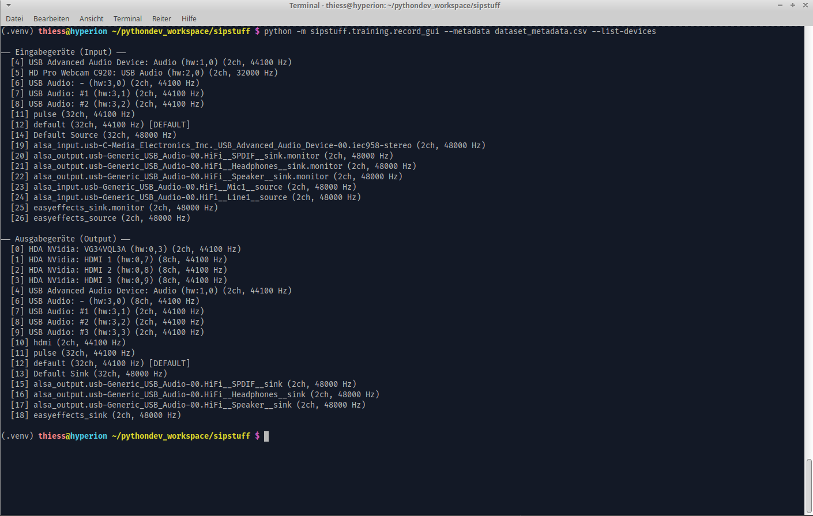

# sipstuff/training — TTS Training Dataset Recorder

A pair of standalone tools for recording speech datasets in **LJSpeech format** for use with [Piper TTS](https://github.com/rhasspy/piper) training. No PJSIP, no SIP stack — these are pure audio recording utilities that work independently of the rest of the sipstuff package.

Two interfaces are provided for different workflows:

| Tool | Interface | Control |
|------|-----------|---------|
| `record_dataset.py` | Terminal (CLI) | Spacebar hold-to-record + text menu |
| `record_gui.py` | PySide6 GUI | Spacebar hold-to-record + clickable buttons |

---

## Table of Contents

- [Purpose](#purpose)
- [LJSpeech Format](#ljspeech-format)
- [Dependencies](#dependencies)
- [record\_dataset.py — Terminal Recorder](#record_datasetpy--terminal-recorder)
  - [CLI Arguments](#cli-arguments-terminal)
  - [Usage Examples](#usage-examples-terminal)
  - [Session Controls](#session-controls)
  - [Architecture](#architecture-terminal)
- [record\_gui.py — GUI Recorder](#record_guipy--gui-recorder)
  - [CLI Arguments](#cli-arguments-gui)
  - [Usage Examples](#usage-examples-gui)
  - [Keyboard Shortcuts](#keyboard-shortcuts)
  - [Architecture](#architecture-gui)
- [Audio Format](#audio-format)
- [Resuming a Session](#resuming-a-session)

---

## Purpose

These tools are designed to build a personal voice dataset sentence by sentence. A `metadata.csv` file drives the session: each line specifies a filename stem and the text to read aloud. The speaker holds the spacebar while speaking, releases it to stop, and the audio is saved as a 16-bit mono WAV file under the chosen output directory.

The resulting `wavs/` directory and the original `metadata.csv` can be handed directly to Piper's training pipeline.

---

## LJSpeech Format

The input `metadata.csv` must follow the LJSpeech pipe-delimited format:

```
filename_stem|raw text|normalized text
```

**Example:**

```
sentence_0001|Hallo Welt!|Hallo Welt
sentence_0002|Guten Morgen, wie geht es Ihnen?|Guten Morgen, wie geht es Ihnen
sentence_0003|Die Temperatur beträgt 22°C.|Die Temperatur beträgt zweiundzwanzig Grad Celsius
```

- Column 1: filename stem — saved as `{stem}.wav` in the output directory
- Column 2: raw text (displayed as reference, not used for training directly)
- Column 3: normalized text — the text the speaker reads aloud; shown prominently in both tools

Lines with fewer than 3 pipe-separated fields are skipped with a warning.

---

## Dependencies

Install before using either tool:

```bash
pip install sounddevice soundfile numpy pynput PySide6
```

| Package | Purpose | Required by |
|---------|---------|-------------|
| `sounddevice` | Audio capture and playback via PortAudio | Both |
| `soundfile` | Writing and reading WAV files (libsndfile) | Both |
| `numpy` | Audio buffer concatenation, RMS calculation, waveform rendering | Both |
| `pynput` | Global keyboard listener for spacebar detection | `record_dataset.py` only |
| `PySide6` | Qt6 GUI framework (widgets, threads, custom painting) | `record_gui.py` only |

`pynput` is not needed for `record_gui.py` — the GUI captures the spacebar via Qt's `keyPressEvent`/`keyReleaseEvent` directly.

---

## record_dataset.py — Terminal Recorder

A fully terminal-based recorder. It walks through the `metadata.csv` line by line, prints the text to read, then waits for the spacebar. Recording starts the moment the spacebar is pressed and stops when it is released. After each recording the file is played back automatically, and a short menu lets the speaker decide what to do next.

A global `pynput` keyboard listener runs in a daemon thread so the spacebar is detected even without the terminal having input focus.

### CLI Arguments (Terminal)

| Argument | Type | Default | Description |
|----------|------|---------|-------------|
| `--metadata` | `str` | `metadata.csv` | Path to the LJSpeech-format metadata file |
| `--output` | `str` | `./wavs` | Output directory for WAV files (created if absent) |
| `--start` | `int` | `1` | 1-based line number to start from (for resuming) |
| `--samplerate` | `int` | `22050` | Recording sample rate in Hz |
| `--channels` | `int` | `1` | Number of channels (1 = mono) |
| `--device` | `int` | system default | Audio input device ID |
| `--list-devices` | flag | — | Print available input devices and exit |

### Usage Examples (Terminal)

List available audio input devices:

```bash
python record_dataset.py --list-devices
```

Start a new session with defaults (reads `metadata.csv`, saves to `./wavs`):

```bash
python record_dataset.py
```

Specify a custom metadata file and output directory:

```bash
python record_dataset.py --metadata data/my_sentences.csv --output data/wavs
```

Resume from sentence 47 (after a previous session was interrupted):

```bash
python record_dataset.py --start 47
```

Use a specific microphone and sample rate:

```bash
python record_dataset.py --device 2 --samplerate 44100
```

### Session Controls

After each recording the tool plays back the audio automatically and then shows:

```
  Was möchtest du tun?
    [Enter] = OK, weiter  |  [N] = Nochmal  |  [W] = Wiedergabe  |  [Q] = Beenden
```

| Input | Action |
|-------|--------|
| `Enter` | Accept recording and advance to the next sentence |
| `N` + `Enter` | Discard and re-record the current sentence |
| `W` + `Enter` | Play back the saved file again |
| `S` + `Enter` | Skip the current sentence (no recording saved) |
| `Q` + `Enter` | Quit; prints the exact `--start` flag to resume |
| `Ctrl+C` | Emergency exit; also prints the resume command |

### Architecture (Terminal)

- `start_keyboard_listener()` — launches a `pynput.keyboard.Listener` as a daemon thread. Two `threading.Event` objects (`space_pressed`, `space_released`) bridge the listener thread to the main loop.
- `record_while_space_held()` — opens a `sounddevice.InputStream` with a callback that appends 1024-sample blocks to a list. The stream runs inside a `with` block that blocks on `space_released.wait()`, so it closes cleanly the instant the spacebar comes up.
- `save_wav()` — concatenates chunks with `numpy.concatenate` and writes a 16-bit PCM WAV via `soundfile.write`.
- `show_progress()` — renders a Unicode block-character progress bar.
- Already-recorded files are detected by checking for the `.wav` on disk; they are flagged with a warning but not overwritten unless the speaker explicitly re-records.

---

## record_gui.py — GUI Recorder

A PySide6 application with the same hold-to-record workflow, but with a scrollable sentence table, live VU meter, waveform display, and progress tracking. All heavy I/O runs in Qt worker threads so the UI remains responsive.

The colour scheme follows the **Catppuccin Mocha** dark palette (`#1e1e2e` base, `#cdd6f4` text, `#89b4fa` accent).

### CLI Arguments (GUI)

| Argument | Type | Default | Description |
|----------|------|---------|-------------|
| `--metadata` | `str` | `metadata.csv` | Path to the LJSpeech-format metadata file |
| `--output` | `str` | `./wavs` | Output directory for WAV files |
| `--samplerate` | `int` | `22050` | Recording sample rate in Hz |
| `--channels` | `int` | `1` | Number of channels |
| `--device` | `int` | system default | Audio input device ID (also selectable in-app) |

### Usage Examples (GUI)

Launch with defaults:

```bash
python record_gui.py
```

Point to a specific dataset:

```bash
python record_gui.py --metadata data/sentences.csv --output data/wavs
```

Override sample rate and pre-select a device:

```bash
python record_gui.py --samplerate 44100 --device 3
```

### Keyboard Shortcuts

| Key | Action |
|-----|--------|
| `Space` (hold) | Start recording |
| `Space` (release) | Stop recording and save |
| `Enter` / `Return` | Advance to next sentence |
| `P` | Play back the current recording |

### Audio Device Selection



### Architecture (GUI)

**`RecordThread(QThread)`**
Runs `sounddevice.InputStream` in a background thread. For every 1024-sample block it computes the RMS value, normalises it against int16 full-scale (32768), and emits a `level_update` signal to drive the VU meter. When `stop()` is called, it raises `sd.CallbackAbort` from inside the callback to cleanly terminate the stream, then emits `finished_recording` with the concatenated audio array.

**`PlayThread(QThread)`**
Reads a WAV file with `soundfile.read` and streams it through a `sounddevice.OutputStream` callback. Emits `position_update` (0.0–1.0) on every block so the waveform widget can draw a playback cursor. Raises `sd.CallbackStop` when the end of the file is reached.

**`VUMeter(QWidget)`**
Custom-painted vertical level meter. A `QLinearGradient` maps green (bottom) through yellow to red (top). A white peak-hold marker decays slowly via a 50 ms `QTimer`. Level and peak both decay when no signal is coming in, giving a natural fall-off between recordings.

**`WaveformWidget(QWidget)`**
Renders the most recently recorded audio as a min/max envelope waveform (one vertical line per pixel, showing the amplitude range of the samples mapped to that column). The orange playback cursor updates in real time during `PlayThread` execution. Duration in seconds is printed in the bottom-left corner.

**`StatusIndicator(QLabel)`**
Colour-coded status badge with four states:

| State | Text | Colour |
|-------|------|--------|
| `idle` | Bereit | Grey |
| `recording` | AUFNAHME | Red |
| `playing` | Wiedergabe | Blue |
| `saved` | Gespeichert | Green |

**`RecorderWindow(QMainWindow)`**
The main window. On startup it scans `output_dir` for existing `.wav` files, marks them in the table, and auto-scrolls to the first unrecorded sentence. The input device can be switched at any time from a combo box at the bottom of the window without restarting. On close, any running threads are stopped and waited on (up to 2 seconds each) before the window is destroyed.

---

## Audio Format

Both tools record and save audio as:

| Property | Value |
|----------|-------|
| Format | WAV |
| Sample format | PCM 16-bit (signed integer) |
| Default sample rate | 22050 Hz |
| Default channels | 1 (mono) |
| Block size | 1024 samples |

The 22050 Hz / 16-bit mono combination matches the default expected by Piper's training pipeline. Change `--samplerate` if your target model requires a different rate (e.g. 16000 Hz for some acoustic models).

---

## Resuming a Session

Both tools are safe to restart mid-dataset. The terminal tool prints the exact resume command on quit or interrupt:

```
  Fortsetzen mit: python record_dataset.py --start 47
```

The GUI tool automatically scrolls to and selects the first sentence that does not yet have a corresponding `.wav` file on disk when it opens. Already-recorded files are shown with a green check mark in the Status column and are not overwritten unless the speaker explicitly re-records them.
